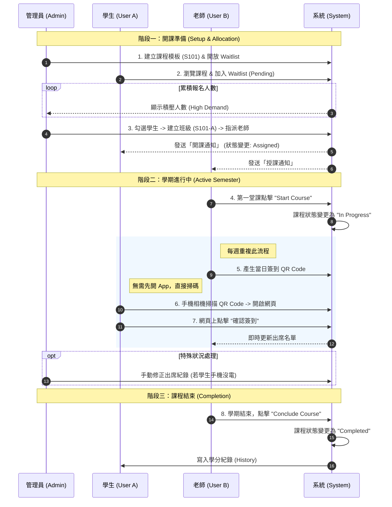

```mermaid
sequenceDiagram
autonumber
participant Admin as 管理員 (Admin)
participant Student as 學生 (User A)
participant Teacher as 老師 (User B)
participant System as 系統 (System)

    Note over Admin, System: 階段一：開課準備 (Setup & Allocation)

    Admin->>System: 1. 建立課程模板 (S101) & 開放 Waitlist
    Student->>System: 2. 瀏覽課程 & 加入 Waitlist (Pending)

    loop 累積報名人數
        System-->>Admin: 顯示積壓人數 (High Demand)
    end

    Admin->>System: 3. 勾選學生 -> 建立班級 (S101-A) -> 指派老師
    System-->>Student: 發送「開課通知」 (狀態變更: Assigned)
    System-->>Teacher: 發送「授課通知」

    Note over Admin, System: 階段二：學期進行中 (Active Semester)

    Teacher->>System: 4. 第一堂課點擊 "Start Course"
    System->>System: 課程狀態變更為 "In Progress"

    rect rgb(240, 248, 255)
        Note right of Teacher: 每週重複此流程
        Teacher->>System: 5. 產生當日簽到 QR Code
        Note right of Student: 無需先開 App，直接掃碼
        Student->>System: 6. 手機相機掃描 QR Code -> 開啟網頁
        Student->>System: 7. 網頁上點擊 "確認簽到"
        System-->>Teacher: 即時更新出席名單
    end

    opt 特殊狀況處理
        Admin->>System: 手動修正出席紀錄 (若學生手機沒電)
    end

    Note over Admin, System: 階段三：課程結束 (Completion)

    Teacher->>System: 8. 學期結束，點擊 "Conclude Course"
    System->>System: 課程狀態變更為 "Completed"
    System->>Student: 寫入學分紀錄 (History)
```
