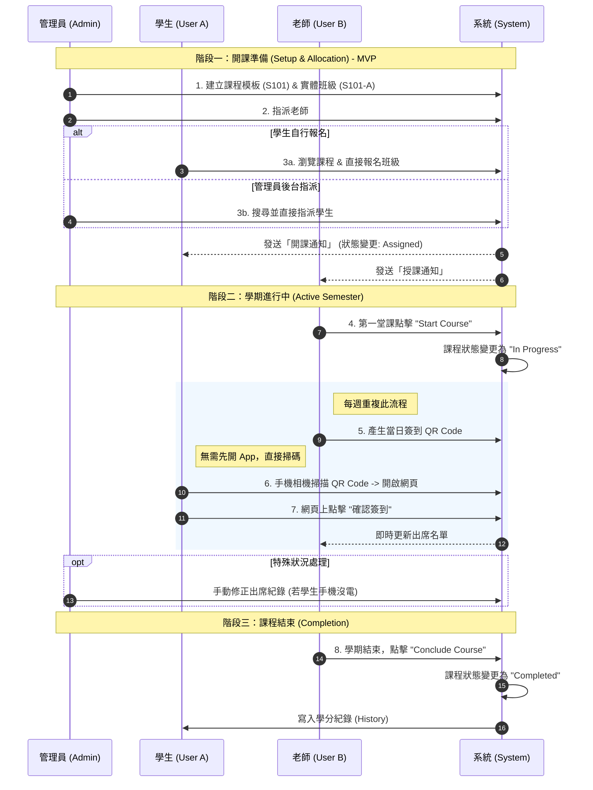

## MVP 決策紀錄 (2026-06)

為了在 MVP 階段減少管理員的行政工作，並貼近教會現行的實務流程，我們針對「階段一：開課準備」進行了簡化：

1. **取消 Waitlist 中間狀態**：原設計為學生先加入 Waitlist 累積需求，管理員再依此建班並指派。現改為管理員直接建班，學生直接報名班級。
2. **管理員直接指派**：在後台，管理員可直接從 `members` (會友庫) 中搜尋並勾選學生，直接將其加入班級（`ASSIGNED` 狀態）。

> [!NOTE]
> 雖然目前取消了 Waitlist 流程，但後端的 `joinWaitlist` 相關邏輯與 `PENDING_WAITLIST` 狀態仍被保留，以便未來若需重新引入此機制（如收集學生偏好與開課需求預測）時可以快速啟用。
